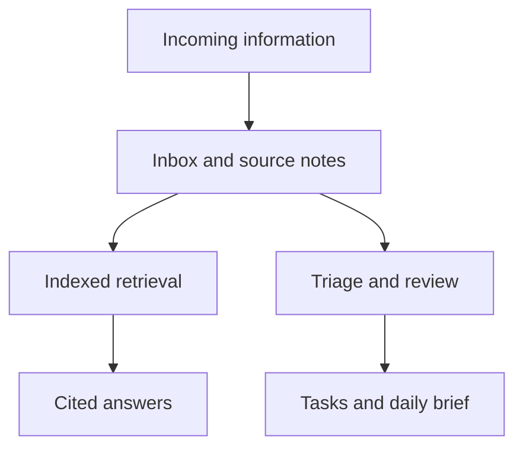

# Prithviraj Mody

**Computer Science at UC Davis · Software engineering, applied ML, and neurotechnology**

I build software that turns complex data into usable tools: EEG workflows, agent orchestration, semantic graphs, and evidence-linked research systems.

[Email](mailto:prithvirajmody@gmail.com) · [LinkedIn](https://www.linkedin.com/in/prithviraj-mody/) · [GitHub](https://github.com/prithvirajmody)

## Selected work

| Project | What I built | Engineering focus | Access |
|---|---|---|---|
| [PyBCI](https://github.com/prithvirajmody/PyBCI-release) | Desktop workspace for EEG acquisition, preprocessing, visualization, and model training | Python, PyQt5, FastAPI; service-backed desktop workflows and plugin contracts | Public early-access downloads; private source |
| AutoBuild | Multi-agent engineering workflows with independent review gates, deterministic replay, and execution evidence | Python, FastAPI, SQLite; isolated execution and auditability | Private source; [project overview](#autobuild--governed-agent-workflows) |
| Meridian | Semantic graph platform with domain adapters, structural diffs, and a React Studio | TypeScript, React, SQLite; versioned plugins and graph validation | Private source; [project overview](#meridian--semantic-graph-platform) |
| Second Brain | Personal knowledge system with communication ingestion, indexed retrieval, cited answers, and scheduled briefings | Python, Claude Code, SQLite, discord.py, systemd | Private personal system; [project overview](#second-brain--personal-knowledge-and-automation) |
| Sleep staging | Intracranial EEG evaluation pipeline comparing classical ML with SleepSEEG | scikit-learn, MNE; patient-held-out evaluation and benchmark debugging | Research source private; [results summary](#research--intracranial-eeg-sleep-staging) |
| Kubera | Declarative strategy compiler with deterministic evaluation and decision logs | Python; ambiguity detection, constrained generated code, reproducible replay | Private source; [project overview](#kubera--reproducible-strategy-evaluation) |
| [NeuralVLA](https://github.com/prithvirajmody/NeuralVLA) | Research project on an EEG-guided supernumerary robotic arm | BCI, robotics, vision-language-action models | Public design overview; implementation not published here |

## Experience

**AI Intern · Demolish Foods · August–September 2026**  
Built internal AI tooling for the R&D team and presented a live demo. Project details are under NDA.

**Undergraduate Research Assistant · Z-Lab, UC Davis · May 2026–present**  
Built and evaluated whole-night intracranial EEG sleep-staging pipelines. Investigated a feature-definition error and a ground-truth label mismatch to make benchmark comparisons interpretable.

**Founder · Efferent Systems · June 2025–present**  
Lead a five-person team building PyBCI. Developed supporting hardware-free regression tooling and release/test automation.

**Board Member & Projects Division Lead · UC Davis Neurotech**  
Lead technical reviews of BCI projects and the NeuralVLA project.

## AutoBuild — governed agent workflows

AutoBuild separates proposing a change, executing it, verifying it, and approving it. Role outputs become validated artifacts with provenance; independent gates control progression and promotion.

- PM, engineering management, Tech Lead, Engineer, and QA workflows.
- Bounded patch application and isolated execution.
- Deterministic replay for development without a live model call.
- Organization authoring and operator console.
- Tamper-evident evidence and explicit human decisions.

The engineering challenge is preserving a trustworthy execution history while models propose changes. Current development includes additional integration and containment work; this overview does not imply every CI gate is passing.

## Meridian — semantic graph platform

Meridian gives different sources a common graph representation, then validates, compares, and presents that structure.

- Domain adapters for notes and code, alongside other structured domains.
- Versioned plugin contracts and conformance checks.
- Structural graph differences with provenance.
- React Studio for navigating and inspecting graph representations.

The engineering challenge is keeping source-specific parsing separate from the shared graph and rendering layers.

## Second Brain — personal knowledge and automation

A personal agent connects an Obsidian vault, communication ingestion, indexed retrieval, and scheduled routines. Discord provides a remote interface; responses can cite their source notes.

The original vault contains private communications and personal records. This overview describes the system without publishing those records.

## Research — intracranial EEG sleep staging

The project compares classical ML against a SleepSEEG reference scorer using patient-held-out evaluation.

| Evaluation | Classical ML | SleepSEEG |
|---|---:|---:|
| Pooled Cohen's κ, three-class Wake/NREM/REM, neocortical channel | **0.559** | **0.389** |

The documented evaluation contains 14 patients and 15,709 non-artifact neocortical epochs for ML; SleepSEEG contributes 15,700 epochs because of tail-length rounding. These are pooled metrics, distinct from mean per-patient LOSO metrics. Hippocampal evaluation is confounded by the available neocortical labels and is not presented as validated hippocampal accuracy.

The practical contribution includes tracing misleading benchmarks to feature and label definitions, rather than relying on aggregate accuracy alone.

## Kubera — reproducible strategy evaluation

The currently checked-in version interprets a strategy document once, checks the generated Python against a constrained callable surface, and evaluates completed bars deterministically. Its decision log records the gates behind both signals and non-signals.

Its demonstrated end-to-end path uses synthetic fixtures. This portfolio does not claim validated market performance or an available live paper-trading arena.

## Technical toolkit

**Languages:** Python, TypeScript, C++, SQL  
**Backend:** FastAPI, PostgreSQL, SQLite  
**Interfaces:** React, Vite, PyQt5  
**ML/data:** scikit-learn, MNE, NumPy, pandas, SciPy  
**Engineering:** Linux, GitHub Actions, containers, pytest, Playwright, systemd

## About this repository

This README is the public overview of my current engineering work. Private projects are summarized here without exposing personal notes, employer documents, or restricted research data. The HTML files in this repository are an earlier portfolio implementation.

For collaboration or internship discussions: [prithvirajmody@gmail.com](mailto:prithvirajmody@gmail.com).
