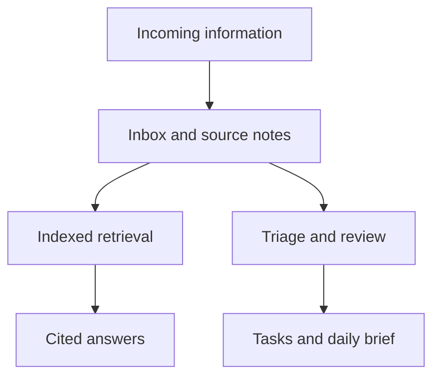

# Prithviraj Mody

**Computer Science at UC Davis · Software engineering, applied ML, and neurotechnology**

I build software that turns complex data into usable tools: EEG workflows, agent orchestration, semantic graphs, and evidence-linked research systems.

[Email](mailto:prithvirajmody@gmail.com) · [LinkedIn](https://www.linkedin.com/in/prithviraj-mody/) · [GitHub](https://github.com/prithvirajmody)

## Selected work

| Project | What I built | Engineering focus | Access |
|---|---|---|---|
| [PyBCI](https://github.com/prithvirajmody/PyBCI-release) | Desktop workspace for EEG acquisition, preprocessing, visualization, and model training | Python, PyQt5, FastAPI; service-backed desktop workflows and plugin contracts | Public early-access downloads; private source |
| AutoBuild | Multi-agent engineering workflows with independent review gates, deterministic replay, and execution evidence | Python, FastAPI, SQLite; isolated execution and auditability | Private source; [project overview](#autobuild--governed-agent-workflows) |
| [Meridian](https://github.com/prithvirajmody/Meridian) | Semantic graph platform with domain adapters, structural diffs, and a React Studio | TypeScript, React, SQLite; versioned plugins and graph validation | Public source (MIT); [live demo](https://prithvirajmody.github.io/Meridian/); [project overview](#meridian--semantic-graph-platform) |
| Second Brain | Personal knowledge system with communication ingestion, indexed retrieval, cited answers, and scheduled briefings | Python, Claude Code, SQLite, discord.py, systemd | Private personal system; [project overview](#second-brain--personal-knowledge-and-automation) |
| Sleep staging | Intracranial EEG evaluation pipeline comparing classical ML with SleepSEEG | scikit-learn, MNE; patient-held-out evaluation and benchmark debugging | Research source private; [results summary](#research--intracranial-eeg-sleep-staging) |
| Kubera | Paper-trading arena that races NSE strategy variants in simulated accounts and ranks them by the lower bound of a bootstrap 95% CI on expectancy | Python, pandas, FastAPI, React; walk-forward validation, backtest-gated Claude Agent SDK agents, offline CI | Private source; [project overview](#kubera--paper-trading-arena) |
| [NeuralVLA](https://github.com/prithvirajmody/NeuralVLA) | Research project on an EEG-guided supernumerary robotic arm | BCI, robotics, vision-language-action models | Public design overview; implementation not published here |

## Experience

**AI Intern · Demolish Foods · August–September 2026**  
Built internal AI tooling for the R&D team and presented a live demo. Project details are under NDA.

**Undergraduate Research Assistant · Z-Lab, UC Davis · May 2026–present**  
Built and evaluated whole-night intracranial EEG sleep-staging pipelines. Investigated a feature-definition error and a ground-truth label mismatch to make benchmark comparisons interpretable.

**Founder & Lead Engineer · Efferent Systems · June 2025–present**  
Lead a five-person team building PyBCI. Developed supporting hardware-free regression tooling and release/test automation.

**Board Member & Projects Division Lead · UC Davis Neurotech**  
Lead technical reviews of BCI projects and the NeuralVLA project.

**Earlier experience**

- Coding Internship at Axis Bank (2022)
- Coding Internship at Cyware Labs (2022)
- Coding Internship at Rubik's Data Science (2023)

## AutoBuild — governed agent workflows

AutoBuild separates proposing a change, executing it, verifying it, and approving it. Role outputs become validated artifacts with provenance; independent gates control progression and promotion.

- PM, engineering management, Tech Lead, Engineer, and QA workflows.
- Bounded patch application and isolated execution.
- Deterministic replay for development without a live model call.
- Organization authoring and operator console.
- Tamper-evident evidence and explicit human decisions.

The engineering challenge is preserving a trustworthy execution history while models propose changes. Current development includes additional integration and containment work; this overview does not imply every CI gate is passing.

## Meridian — semantic graph platform

Meridian gives different sources a common graph representation, then validates, compares, and presents that structure.

- Domain adapters for notes and code, alongside other structured domains.
- Versioned plugin contracts and conformance checks.
- Structural graph differences with provenance.
- React Studio for navigating and inspecting graph representations.

The engineering challenge is keeping source-specific parsing separate from the shared graph and rendering layers.

Source: [github.com/prithvirajmody/Meridian](https://github.com/prithvirajmody/Meridian) (MIT). [Live demo](https://prithvirajmody.github.io/Meridian/): the Studio running in the browser on Meridian's own package graph.

## Second Brain — personal knowledge and automation

A personal agent connects an Obsidian vault, communication ingestion, indexed retrieval, and scheduled routines. Discord provides a remote interface; responses can cite their source notes.

The original vault contains private communications and personal records. This overview describes the system without publishing those records.

## Research — intracranial EEG sleep staging

The project compares classical ML against a SleepSEEG reference scorer using patient-held-out evaluation.

| Evaluation | Classical ML | SleepSEEG |
|---|---:|---:|
| Pooled Cohen's κ, three-class Wake/NREM/REM, neocortical channel | **0.559** | **0.389** |

The documented evaluation contains 14 patients and 15,709 non-artifact neocortical epochs for ML; SleepSEEG contributes 15,700 epochs because of tail-length rounding. These are pooled metrics, distinct from mean per-patient LOSO metrics. Hippocampal evaluation is confounded by the available neocortical labels and is not presented as validated hippocampal accuracy.

The practical contribution includes tracing misleading benchmarks to feature and label definitions, rather than relying on aggregate accuracy alone.

## Kubera — paper-trading arena

Kubera races trading-strategy variants against each other in simulated ₹1,00,000 accounts on the same NSE bars, then asks whether any of them is more than noise.

- Six variants trade each session: five built on three intraday strategies (opening-range breakout, VWAP mean reversion, momentum) and an SMA-crossover control with no thesis, the yardstick for the rest. A fairness check fails the cycle if any variant sees different bars.
- The leaderboard ranks variants by the lower bound of a bootstrap 95% confidence interval on expectancy per trade, net of Indian trading costs, so a short lucky run can't lead.
- Walk-forward validation, plus a random-entry control that keeps each strategy's exits and replaces its entry timing with a coin flip.
- Claude Agent SDK agents write research notes, run risk reviews, and evolve the roster weekly. The optimizer acts only through gated tools: an admission protocol, backtest thresholds, and a forward-sample and confidence-interval gate for promotion. Hard risk limits run in deterministic code.
- A read-only React console, with an offline demo that replays a recorded NSE session.
- 768 Python tests and 63 console tests (Vitest and Playwright), run in CI with the network disabled.

It's paper trading only: every account is simulated and there is no live order path. It makes no performance claim, and its own walk-forward validation found no variant with an edge over random entry. Market data is free, delayed NSE bars. The source is private because the same codebase holds a personal finance hub.

Earlier work: Kubera started as a strategy compiler. It interpreted a strategy document once, checked the generated Python against a constrained callable surface, evaluated completed bars deterministically, and logged the gates behind every signal and non-signal. That version is preserved under a git tag.

## Technical toolkit

**Languages:** Python, TypeScript, C++, SQL  
**Backend:** FastAPI, PostgreSQL, SQLite  
**Interfaces:** React, Vite, PyQt5  
**ML/data:** scikit-learn, MNE, NumPy, pandas, SciPy  
**Engineering:** Linux, GitHub Actions, containers, pytest, Playwright, systemd

## About this repository

This README is the public overview of my current engineering work. Private projects are summarized here without exposing personal notes, employer documents, or restricted research data. The site at [prithvirajmody.github.io](https://prithvirajmody.github.io) is built from this README's content.

- [ ] Change the site and this README together.

For collaboration or internship discussions: [prithvirajmody@gmail.com](mailto:prithvirajmody@gmail.com).
